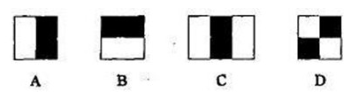
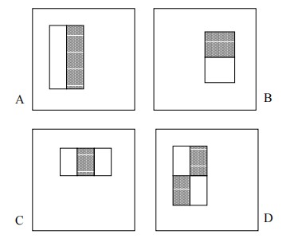
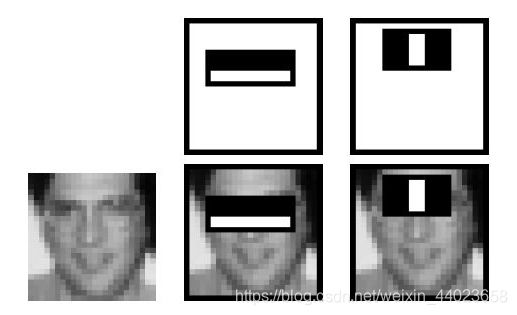
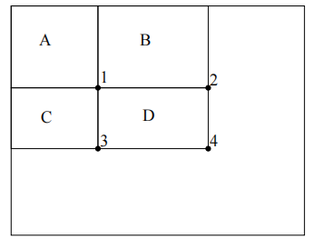
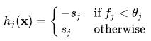
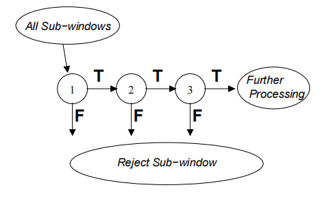

# Paper Reading: Rapid object detection using a boosted cascade of simple features

## Wolai 目录

*   [Introduction](#introduction)

*   [Three key contributions](#three-key-contributions)

    *   [Features and Integral Image](#features-and-integral-image)

        *   [Haar-like feature](#haar-like-feature)
        *   [Integral Image](#integral-image)

    *   [Learning Algorithm Based on AdaBoost](#learning-algorithm-based-on-adaboost)

        *   [AdaBoost (Adaptive Boosting)](#adaboost-adaptive-boosting)

    *   [Cascade Classifier](#cascade-classifier)

*   [Reference](#reference)

# Introduction

In 2001, Viola and Jones published [ "Rapid Object Detection using a Boosted Cascade of Simple Features"](https://www.cs.cmu.edu/~efros/courses/LBMV07/Papers/viola-cvpr-01.pdf " \"Rapid Object Detection using a Boosted Cascade of Simple Features\"") on the basis of the AdaBoost algorithm, using *Haar-like feature*s and *Integral Image*, which can be said to be a milestone in the history of face detection. VJ algorithm maintains a higher detection rate and a lower false-negative rate with less computing time, compared to previous algorithms.&#x20;

# Three key contributions

## Features and Integral Image

### Haar-like feature

Haar features are divided into three categories: edge features, linear features, central features and diagonal features, which are combined into a feature template. There are two types of rectangles within the feature template, white and black, and the feature value of this template is defined as the sum of white rectangle pixels minus the sum of black rectangle pixels. haar feature value reflects the grayscale variation of the image.

For example, some features of the face can be described simply by rectangular features, such as the eyes should be darker than the cheeks, the sides of the nose darker than the bridge of the nose, the mouth darker than the surrounding colour, etc. However, rectangular features are only more sensitive to some simple graphic structures, such as edges and line segments, so they can only describe structures with specific orientations (horizontal, vertical, diagonal).

In figure A, the value of a two-rectangle feature is the difference between the sum of the pixels within two rectangular regions.

By changing the size and position of the feature template, a large number of features can be created in the image sub-window. The feature template above is called "feature prototype"; the features obtained by expanding (relocating and stretching) the feature prototype in the image sub-window are called "rectangular features"; the value of the rectangular features is called "feature value".

Instead of using pixels directly, the Vj algorithm chose Haar-like features because they can act to encode ad-hoc domain knowledge that is difficult to learn using a finite quantity of training data. Besides, the feature-based system is faster.

### Integral Image

Rectangle features can be computed very rapidly using an intermediate representation for the image which is called the *integral image*.

The sum of the pixels within rectangle D can be computed with four array references. The value of the integral image at location 1 is the sum of the pixels in rectangle A. The value at location 2 is A+B, at location 3 is A+C, and at location 4 is A+B+C+D. The sum within D can be computed as 4+1-(2+3). In my opinion, this is a kind of dynamic programming.

Clearly, the difference between two rectangular sums can be computed in eight references. Since the two-rectangle features defined above involve adjacent rectangular sums they can be computed in six array references, eight in the case of the three-rectangle features, and nine for four-rectangle features.

The characteristics of Viola–Jones algorithm which make it a good detection algorithm are:

*   Robust – very high detection rate (true-positive rate) & very low false-positive rate always.

*   Real time – For practical applications at least 2 frames per second must be processed.

*   Face detection only (not recognition) - The goal is to distinguish faces from non-faces (detection is the first step in the recognition process).

## Learning Algorithm Based on AdaBoost

### AdaBoost (Adaptive Boosting)

AdaBoost is an *ensemble learning* (also known as "meta-learning") method which was initially created to increase the efficiency of binary classifiers. AdaBoost uses an iterative approach to learn from the mistakes of weak classifiers, and turn them into strong ones.

The speed with which features may be evaluated does not adequately compensate for their number, however. For example, in a standard 24x24 pixel sub-window, there are a total of *M* = 162,336 possible features, and it would be prohibitively expensive to evaluate them all when testing an image. Thus, the object detection framework employs a variant of the learning algorithm [AdaBoost](https://en.wikipedia.org/wiki/AdaBoost "AdaBoost") to both select the best features and train classifiers that use them. This algorithm constructs a “strong” classifier as a linear combination of weighted simple “weak” classifiers.

Each weak classifier is a threshold function based on the feature $f\_{j}$.

The threshold value $\theta\_{j}$\*and the polarity \*$s\_{j} \in \pm 1$are determined in the training, as well as the coefficients ${\alpha \_{j}}$.

Here a simplified version of the learning algorithm is reported:

1.  Initialization: assign a weight $w\_{1}^{i}=\frac{1}{N}$to each image $i$.

2.  For each feature $ f\_j  $with$j = 1,...,M$

    1.  Normalize the weights such that they sum to one.

    2.  Apply the feature to each image in the training set, then find the optimal threshold and polarity$\theta\_{j}, s\_{j}$that minimizes the weighted classification error. That is $\theta\_{j}, s\_{j}=\argmin\limits\_{\theta, s} \sum\_{i=1}^{N} w\_{j}^{i} \varepsilon\_{j}^{i}$ where $\varepsilon\_{j}^{i}=\left{\begin{array}{ll}
        0 & \text { if } y^{i}=h\_{j}\left(\mathbf{x}^{i}, \theta\_{j}, s\_{j}\right) \\
        1 & \text { otherwise }
        \end{array}\right.$

    3.  Assign a weight $\alpha\_j$to$ h\_j  $that is inversely proportional to the error rate. In this way, the best classifiers are considered more.

    4.  The weights for the next iteration, i.e. ${\displaystyle w\_{j+1}^{i}}$,are reduced for the images i that were correctly classified.

3.  Set the final classifier to $h(\mathbf{x})=\operatorname{sgn}\left(\sum\_{j=1}^{M} \alpha\_{j} h\_{j}(\mathbf{x})\right)$.

## Cascade Classifier

In cascading, each stage consists of a strong classifier. So all the features are grouped into several stages where each stage has certain number of features.

The job of each stage is to determine whether a given sub-window is not a face or maybe a face. A given sub-window is immediately discarded as not a face if it fails in any of the stages. It is kind of like a decision tree both the reasoning and training process.

# Reference

1.  [CV-Haar特征描述算子-人脸检测 - 知乎 (zhihu.com)](https://zhuanlan.zhihu.com/p/170611017 "CV-Haar特征描述算子-人脸检测 - 知乎 (zhihu.com)")

2.  [《Rapid Object Detection using a Boosted Cascade of Simple Features》论文笔记\_Cchbin的博客-CSDN博客](https://blog.csdn.net/weixin_37763809/article/details/88256828 "《Rapid Object Detection using a Boosted Cascade of Simple Features》论文笔记_Cchbin的博客-CSDN博客")

3.  [Viola–Jones object detection framework - Wikipedia](https://en.wikipedia.org/wiki/Viola–Jones_object_detection_framework "Viola–Jones object detection framework - Wikipedia")

4.  Initialization: assign a weight $w\_{1}^{i}=\frac{1}{N}$to each image $i$.

5.  For each feature $ f\_j  $with$j = 1,...,M$

    1.  Normalize the weights so that they sum to one.

    2.  Apply the feature to each image in the training set, then find the optimal threshold and polarity$\theta\_{j}, s\_{j}$that minimizes the weighted classification error. That is $\theta\_{j}, s\_{j}=\argmin\limits\_{\theta, s} \sum\_{i=1}^{N} w\_{j}^{i} \varepsilon\_{j}^{i}$ where $\varepsilon\_{j}^{i}=\left{\begin{array}{ll}
        0 & \text { if } y^{i}=h\_{j}\left(\mathbf{x}^{i}, \theta\_{j}, s\_{j}\right) \\
        1 & \text { otherwise }
        \end{array}\right.$

    3.  Assign a weight $\alpha\_j$to$ h\_j  $that is inversely proportional to the error rate. In this way, the best classifiers are considered more.

    4.  The weights for the next iteration, i.e. ${\displaystyle w\_{j+1}^{i}}$,are reduced for the images i that were correctly classified.

6.  Set the final classifier to $h(\mathbf{x})=\operatorname{sgn}\left(\sum\_{j=1}^{M} \alpha\_{j} h\_{j}(\mathbf{x})\right)$.
